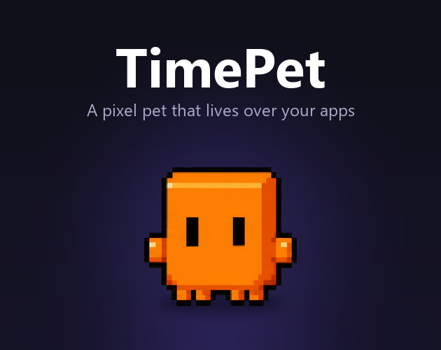
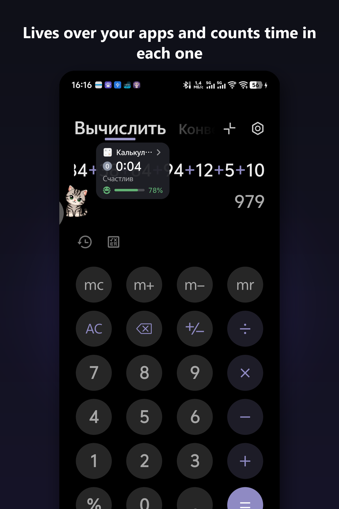
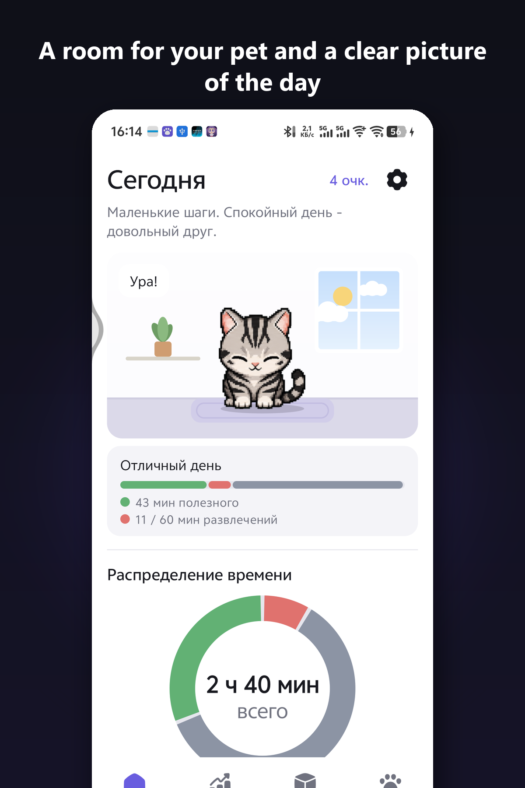
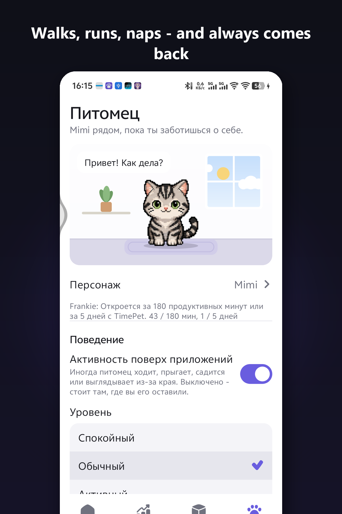
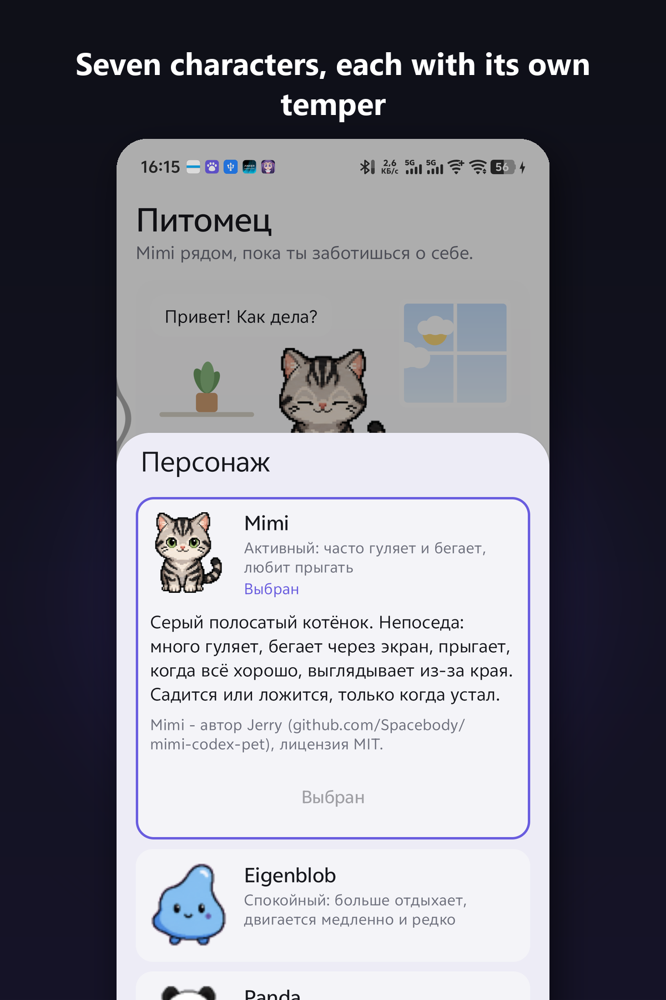
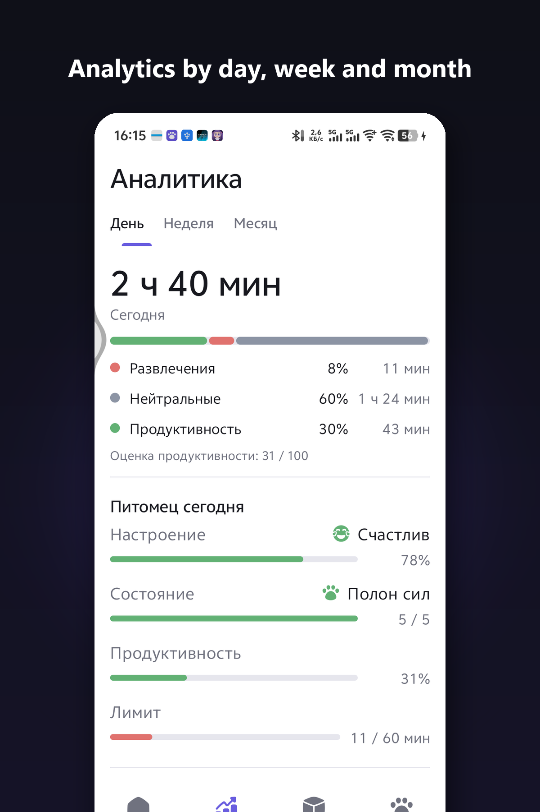
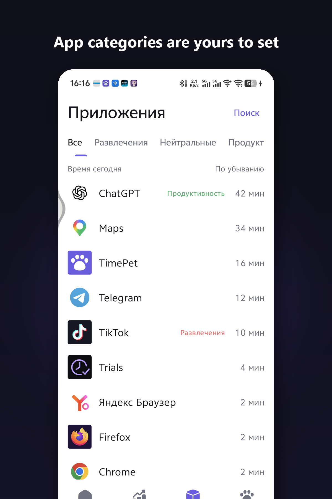

  

<h1 align="center">TimePet</h1>

A tiny pixel pet that lives on top of your apps and shows where your time really goes.

<b>Download:</b> <a href="https://nooxax.itch.io/timepet">itch.io page</a> · Android 8.0+

  

## What it does

- **Lives over your apps.** A pixel-art pet sits on top of whatever app you are using, next to a small timer that counts how long you have been in that app today.
- **Has a mood.** Study, reading, coding, planning - the pet perks up. Endless feeds past your daily fun limit - it gets tired and sad. Come back to something useful and it cheers up again.
- **Moves on its own.** Walks, runs, jumps, sits, naps, peeks from the edge and always comes back to your timer. Double-tap for "Do not disturb".
- **Seven characters** with different tempers. Three are available right away, the rest unlock with productive minutes or days spent with the app.
- **Calm home screen and analytics** - a room for your pet (day and night), today's mood, time split, hourly chart, categories you set yourself.
- **Nothing leaves the device.** No account, no cloud, no ads, no tracking.
- **Languages:** English, Russian, German.

## Screenshots

| | | |
|---|---|---|
|  |  |  |
|  |  |  |

## Requirements

Android 8.0 or newer. On first launch the app asks for two permissions it cannot work without: **Usage access** (to know which app is open and for how long) and **Display over other apps** (to show the pet). Both are explained on the welcome screen.

## About this repository

This repository is the project page for TimePet: description, screenshots and credits. The app itself is distributed as an APK on itch.io; the source code is not published here.

## Credits

Pixel-art characters are community Codex-pet sprites (MIT / CC BY-NC), see [CREDITS.md](CREDITS.md). Icons: Streamline Plump (CC BY 4.0). Free and non-commercial.

---

Русский

**TimePet** - маленький пиксельный питомец, который живёт поверх твоих приложений и показывает, куда на самом деле уходит время.

- Сидит поверх любого приложения рядом с таймером, который считает время именно в нём за сегодня.
- Настроение зависит от дня: полезные приложения радуют, ленты сверх лимита утомляют.
- Гуляет, бегает, дремлет, выглядывает из-за края и всегда возвращается к таймеру. Двойной тап - «Не беспокоить».
- Семь персонажей с разным характером; трое доступны сразу, остальные открываются за полезные минуты или дни с приложением.
- Спокойный главный экран, аналитика за день, неделю и месяц, категории приложений назначаешь сам.
- Всё остаётся на устройстве: без аккаунта, облака, рекламы и трекеров.
- Языки: русский, английский, немецкий.

Android 8.0 и новее. Скачать: страница на itch.io. Этот репозиторий - страница проекта (описание, скриншоты, авторы); исходный код здесь не публикуется.

